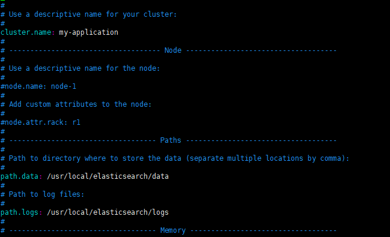
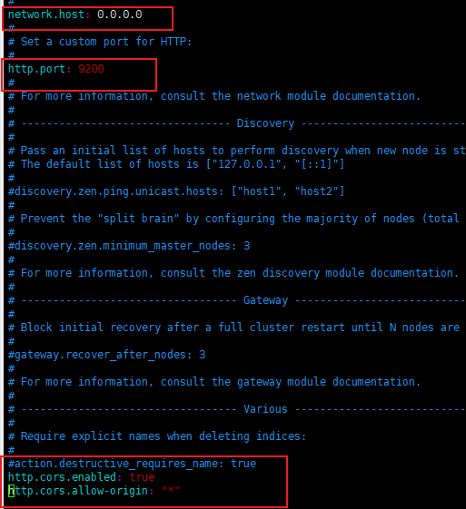
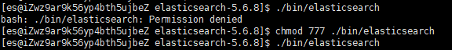
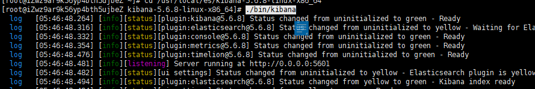

# elasticsearch学习

## 1 什么是Elasticsearch？

> ```
> ElaticSearch，简称为es， es是一个开源的高扩展的分布式全文检索引擎,它可以近乎实时的存储、检索数据,处理PB级别的数据,提供了一套RESTful API操作索引库。es也使用Java开发并使用Lucene作为其核心来实现所有索引和搜索的功能，但是它的目的是通过简单的RESTful API来隐藏Lucene的复杂性，从而让全文搜索变得简单。
> 
> 什么是PB级别的数据？
> 
> 数据单位：B、KB、MB、GB、TB、PB
> 
> 1PB=1024TB，依次类推。
> ```

它不仅包括了全文搜索功能，还可以进行以下工作:

- 分布式实时文件存储，并将每一个字段都编入索引，使其可以被搜索。
- 实时分析的分布式搜索引擎。
- 可以扩展到上百台服务器，处理PB级别的结构化或非结构化数据。


## 2 Elasticsearch使用案例

2013年初，GitHub抛弃了Solr，采取ElasticSearch 来做PB级的搜索。 “GitHub使用ElasticSearch搜索20TB的数据，包括13亿文件和1300亿行代码”

维基百科：启动以elasticsearch为基础的核心搜索架构

SoundCloud：“SoundCloud使用ElasticSearch为1.8亿用户提供即时而精准的音乐搜索服务”

百度：百度目前广泛使用ElasticSearch作为文本数据分析，采集百度所有服务器上的各类指标数据及用户自定义数据，通过对各种数据进行多维分析展示，辅助定位分析实例异常或业务层面异常。目前覆盖百度内部20多个业务线（包括casio、云析分、网盟、预测、文库、直达号、钱包、风控等），单集群最大100台机器，200个ES节点，每天导入30TB+数据

新浪：使用ES 分析处理32亿条实时日志

阿里：使用ES 构建挖财自己的日志采集和分析体系


## 3 Elasticsearch 与 Solr 的比较

> ```properties
> 1 Solr 利用 Zookeeper 进行分布式管理，而 Elasticsearch 自身带有分布式协调管理功能;
> 
> 2 Solr 支持更多格式的数据，而 Elasticsearch 仅支持json文件格式；
> 
> 3 Solr 官方提供的功能更多，而 Elasticsearch 本身更注重于核心功能，高级功能多由第三方插件提供；
> 
> 4 Solr 在传统的搜索应用中表现好于 Elasticsearch，但在处理实时搜索应用时效率明显低于 Elasticsearch；
> 
> 5 Elasticsearch支持RestFul风格编程（uri的地址，就可以检索），Solr暂不支持
> ```


## 4 Elasticsearch 的安装

**官方网址：** <https://www.elastic.co/cn/elasticsearch>


访问官网，点 **past releases** 下载你需要的版本


> ```
> 注意elasticsearch相关软件对版本要求非常严，elasticsearch相关的软件一定要下载其对应版本
> ```


### 4.1 Window 安装

Window版的ElasticSearch的安装很简单，类似Window版的Tomcat，解压开即安装完毕，解压后的ElasticSearch的目录结构如下：

注意：ES的目录不要出现中文，也不要有特殊字符。


#### 4.1.1 启动 ES


**启动**


**解释：**

```properties
注意：
9300是tcp通讯端口，集群间和TCPClient都执行该端口，可供java程序调用；
9200是http协议的RESTful接口 。
通过浏览器访问ElasticSearch服务器，看到如下返回的json信息，代表服务启动成功：
```

**访问地址：**


注意事项一：ElasticSearch是使用java开发的，且本版本的es需要的jdk版本要是1.8以上，所以安装ElasticSearch之前保证JDK1.8+安装完毕，并正确的配置好JDK环境变量，否则启动ElasticSearch失败。

注意事项二：出现闪退，通过路径访问发现“空间不足”

【解决方案】

修改jvm.options文件的22行23行，把2改成1，让Elasticsearch启动的时候占用1个G的内存。


如果1个g还是不行：


```
-Xmx512m：设置JVM最大可用内存为512M。

-Xms512m：设置JVM初始内存为512m。此值可以设置与-Xmx相同，以避免每次垃圾回收完成后JVM重新分配内存。
```


### 4.2 linux 安装


#### 4.2.1 添加用户组

```properties
groupadd es 创建组

useradd -g es es 创建用户，并且加入es组

passwd es  为es用户设定登录密码
```


#### 4.2.2 把压缩包拉到安装目录并解压


#### 4.2.3 修改elasticsearch 配置文件

**修改config目录下的elasticsearch.yml文件**








```properties
network.host: 0.0.0.0

http.port: 9200

mkdir -p /usr/local/elasticsearch/data

mkdir -p /usr/local/elasticsearch/logs

http.cors.enabled: true
http.cors.allow-origin: "*"
```

**修改elasticsearch jvm.options文件**

```properties
# Xms represents the initial size of total heap space
# Xmx represents the maximum size of total heap space

-Xms512m
-Xmx512m

```


#### 4.2.4 设置sudo权限

```properties
设置sudo权限

[root@localhost ~]# visudo

在root ALL=(ALL) ALL 一行下面

添加es用户 如下:

es ALL=(ALL) ALL
```

添加成功保存后切换到es用户操作启动es

```properties
[root@localhost ~]# su es

su es  使用es用户
```

**进到elasticsearch解压目录** 

```properties
./bin/elasticsearch 前台启动
./bin/elasticsearch -d 后台启动

```

#### 4.2.5 出现权限问题




**授权es文件夹下的文件**

```properties
切到root用户

sudo chmod -R 777 /usr/local/es/

sudo chmod -R 777  /usr/local/elasticsearch/data

sudo chmod -R 777 /usr/local/elasticsearch/logs

sudo chmod -R 777 /usr/local/java/jdk1.8.0_192/bin/jps
```


#### 4.2.6 重新启动ES如果报这个错误需要修改


```properties
vim /etc/sysctl.conf 
```

添加下面配置

```properties
vm.max_map_count=262144
```

然后执行 **sysctl -p**

编辑 **/etc/security/limits.conf**文件

```properties
vim /etc/security/limits.conf，追加以下内容；
* soft nofile 65536
* hard nofile 65536
此文件修改后需要重新登录用户，才会生效
```

**访问 9200端口出现以下界面说明安装成功**


## 5 ES图形化界面安装

### 5.1 安装elasticsearch-head-master

**window的安装**

**安装前需要安装 node.js**

**下载nodejs：**<https://nodejs.org/en/download/> 

**安装npm**

```
npm install
```

**ps:** 如果安装不成功或者安装速度慢，可以使用淘宝的镜像进行安装：

```properties
npm install -g cnpm –registry=https://registry.npm.taobao.org
```

后续使用的时候，只需要把npm xxx   换成  cnpm xxx 即可


Grunt是基于Node.js的项目构建工具；是基于javaScript上的一个很强大的前端自动 化工具，基于NodeJs用于自动化构建、测试、生成文档的项目管理工具。 

将grunt安装为全局命令 ，Grunt是基于Node.js的项目构建工具；是基于javaScript上的一个很强大的前端自动化工具，基于NodeJs用于自动化构建、测试、生成文档的项目管理工具。

在cmd控制台中输入如下执行命令：

```properties
npm install -g grunt-cli
```

-g表示全局（globle）变量，让grunt-cli的客户端使用全局安装

执行结果如下图：


**下载head插件：**<https://github.com/mobz/elasticsearch-head>

下载然后解压进到进到elasticsearch-head-master目录

> 然后执行 grunt server 启动 即可访问


#### 5.1.1 使用wget命令下载

```
node.js下载地址：https://nodejs.org/en/download/
```

#### 5.1.2 直接去官网下载node.js

```
wget https://nodejs.org/dist/v12.14.0/node-v12.14.0-linux-x64.tar.xz
```

#### 5.1.3 或者上传到服务器解压

```properties
xz -d node-v12.14.0-linux-x64.tar.xz
tar -xvf node-v12.14.0-linux-x64.tar

移动到 /usr/local目录
mv node-v12.14.0-linux-x64 /usr/local/node-v12.14.0
```

#### 5.1.4 创建软连接

```properties
ln -s /usr/local/node-v12.14.0/bin/node /usr/local/bin/node
ln -s /usr/local/node-v12.14.0/bin/npm /usr/local/bin/npm
```

**查看是否安装成功**


**node.js安装成功后进到elasticsearch-head-master目录**

执行以下命令将grunt安装为全局命令

```properties
有可能会遇到安装很慢，所以可以先安装淘宝镜像，然后利用cnpm安装
npm install -g cnpm --registry=https://registry.npm.taobao.org

为 cnpm 创建软连接
ln -s /usr/local/node-v12.14.0/bin/cnpm /usr/local/bin/cnpm

安装grunt
cnpm install -g grunt --registry=https://registry.npm.taobao.org

为 grunt 创建软连接
ln -s /usr/local/node-v12.14.0/bin/grunt /usr/local/bin/grunt
```


#### 5.1.5 修改配置文件

cd 进入elasticsearch-head-master 文件夹下，

```properties
执行命令vim Gruntfile.js文件：增加hostname属性，设置为*

hostname: '*',
```

如图： 

 


#### 5.1.6 修改 vim _site/app.js 文件：修改head的连接地址:

**如图所示：**

```properties
cd _site
 
find -name 'app.js' | xargs perl -pi -e 's|http://localhost:9200|http://192.168.220.234:9200|g'
```


#### 5.1.7 最后执行grunt server ，就可以去网页访问了

```properties
grunt server 
```


### 5.2 kibana 安装

下载 ES 对应版本进到解压目录执行启动命令就行



```
./bin/kibana
nohup ./bin/kibana & 守护进程启动
```


## 6 IK分词器

### 6.1 目标

- 能安装IK分词器
- 会配置扩展词库和停用词库


### 6.2 讲解

在进行词条查询时，我们搜索"搜索"却没有搜索到数据！

原因：lucene默认是单字分词，在开发中不符合查询的需求，需要定义一个支持中文的分词器。

解决方案：IK分词器


(1)IK分词器简介

IKAnalyzer是一个开源的，基于java语言开发的轻量级的中文分词工具包。


(2)ElasticSearch集成IK分词器

```properties
1.解压elasticsearch-analysis-ik-2.x后,将文件夹拷贝到elasticsearch-6.3.2\plugins下，并重命名文件夹为ik
2. 重新启动ElasticSearch，即可加载IK分词器
```


在使用ik分词器之前：使用rest方式访问elasticsearch的分词效果，默认的分词是standard

**IK分词器地址：**https://link.zhihu.com/?target=https%3A//github.com/medcl/elasticsearch-analysis-ik


**IK分词器有两种分词模式：**ik_max_word和ik_smart模式。

**1、ik_max_word**

会将文本做最细粒度的拆分，比如会将“中华人民共和国人民大会堂”拆分为“中华人民共和国、中华人民、中华、华人、人民共和国、人民、共和国、大会堂、大会、会堂等词语。


**2、ik_smart**

会做最粗粒度的拆分，比如会将“中华人民共和国人民大会堂”拆分为中华人民共和国、人民大会堂。


### 6.3 ES默认的分词器standard对中文的分词效果

```properties
在kibana调用api

GET _analyze?pretty
{
  "analyzer": "standard",
  "text":"我是中国人"
}

```


### 6.4 使用 ik分词器 的 ik_smart 分词效果

```properties
GET _analyze?pretty
{
  "analyzer": "ik_smart",
  "text":"我是中国人"
}

```


### 6.5 使用 ik分词器 的ik_max_word分词效果

```properties
GET _analyze?pretty
{
  "analyzer": "ik_max_word",
  "text":"我是中国人"
}
```


## 7 kibana DSL语句使用

```properties
#查看所有索引
GET /_cat/indices?v

#删除某个索引
DELETE /skuinfo

#新增索引
PUT /user

#创建映射
PUT /user/userinfo/_mapping
{
  "properties": {
    "name":{
      "type": "text",
      "analyzer": "ik_smart",
      "search_analyzer": "ik_smart",
      "store": false
    },
    "city":{
      "type": "text",
      "analyzer": "ik_smart",
      "search_analyzer": "ik_smart",
      "store": false
    },
    "age":{
      "type": "long",
      "store": false
    },
    "description":{
      "type": "text",
      "analyzer": "ik_smart",
      "search_analyzer": "ik_smart",
      "store": false
    }
  }
}


#新增文档数据 id=1
PUT /user/userinfo/1
{
  "name":"李四",
  "age":22,
  "city":"深圳",
  "description":"李四来自湖北武汉！"
}

#新增文档数据 id=2
PUT /user/userinfo/2
{
  "name":"王五",
  "age":35,
  "city":"深圳",
  "description":"王五家住在深圳！"
}

#新增文档数据 id=3
PUT /user/userinfo/3
{
  "name":"张三",
  "age":19,
  "city":"深圳",
  "description":"在深圳打工，来自湖北武汉"
}

#新增文档数据 id=4
PUT /user/userinfo/4
{
  "name":"张三丰",
  "age":66,
  "city":"武汉",
  "description":"在武汉读书，家在武汉！"
}

#新增文档数据 id=5
PUT /user/userinfo/5
{
  "name":"赵子龙",
  "age":77,
  "city":"广州",
  "description":"赵子龙来自深圳宝安，但是在广州工作！",
  "address":"广东省茂名市"
}

#新增文档数据 id=6
PUT /user/userinfo/6
{
  "name":"赵毅",
  "age":55,
  "city":"广州",
  "description":"赵毅来自广州白云区，从事电子商务8年！"
}

#新增文档数据 id=7
PUT /user/userinfo/7
{
  "name":"赵哈哈",
  "age":57,
  "city":"武汉",
  "description":"武汉赵哈哈，在深圳打工已有半年了，月薪7500！"
}

#更新数据,id=4
PUT /user/userinfo/4
{
  "name":"张三丰",
  "description":"在武汉读书，家在武汉！在深圳工作！"
}


#根据ID查询
GET /user/userinfo/4

#恢复文档数据 id=4
PUT /user/userinfo/4
{
  "name":"张三丰",
  "age":66,
  "city":"武汉",
  "description":"在武汉读书，家在武汉！"
}

#使用POST更新某个域的数据
POST /user/userinfo/4/_update
{
  "doc":{
    "name":"张三丰",
    "description":"在武汉读书，家在武汉！在深圳工作！"
  }
}

#根据ID查询
GET /user/userinfo/4

#删除数据
DELETE user/userinfo/4

#查询所有
GET /user/_search

#根据ID查询
GET /user/userinfo/2

#搜索排序
GET /user/_search
{
  "query":{
    "match_all": {}
  },
  "sort":{
    "age":{
      "order":"desc"
    }
  }
}

#分页实现
GET /user/_search
{
  "query":{
    "match_all": {}
  },
  "sort":{
    "age":{
      "order":"desc"
    }
  },
  "from": 0,
  "size": 2
}

#过滤查询-term
GET _search
{
  "query":{
    "term":{
      "city":"武汉"
    }
  }
}

#过滤查询-terms 允许多个Term
GET _search
{
  "query":{
    "terms":{
      "city":
        [
          "武汉",
          "广州"
        ]
    }
  }
}

#过滤-range 范围过滤
#gt表示> gte表示=>
#lt表示< lte表示<=
GET _search
{
  "query":{
    "range": {
      "age": {
        "gte": 30,
        "lte": 57
      }
    }
  }
}


#过滤搜索 exists：是指包含某个域的数据检索
GET _search
{
  "query": {
    "exists":{
      "field":"address"
    }
  }
}


#过滤搜索 bool 
#must : 多个查询条件的完全匹配,相当于 and。
#must_not : 多个查询条件的相反匹配，相当于 not。
#should : 至少有一个查询条件匹配, 相当于 or。
GET _search
{
  "query": {
    "bool": {
      "must": [
        {
          "term": {
            "city": {
              "value": "深圳"
            }
          }
        },
        {
          "range":{
            "age":{
              "gte":20,
              "lte":99
            }
          }
        }
      ]
    }
  }
}

#查询所有 match_all
GET _search
{
  "query": {
    "match_all": {}
  }
}

#字符串匹配
GET _search
{
  "query": {
    "match": {
      "description": "武汉"
    }
  }
}

#前缀匹配 prefix
GET _search
{
  "query": {
    "prefix": {
      "name": {
        "value": "赵"
      }
    }
  }
}

#多个域匹配搜索
GET _search
{
  "query": {
    "multi_match": {
      "query": "深圳",
      "fields": [
        "city",
        "description"
      ]
    }
  }
}


GET /new_gnmpp/newMedia/_search
{
    "from" : 0, "size" : 5,
   "_source":{
     "excludes": [ "object.content" ]
   },
    "query": {
        "bool": {
            "must": [
                { "match_phrase": { "plateType":  "8" }},
                { "match_phrase": { "informationType":  "1" }}
                
            ]
        }
    }
  
}


GET /new_gnmpp/newMedia/_search
{
    "from" : 0, "size" : 5,
   "_source":{
     "excludes": [ "object.content" ]
   },
    "query": {
       "range": {
          "createTime.keyword": {
            "gte": "2020-04-29",
             "lt": "2020-04-30"
          }
       }
    }
}


#elasticsearch7
PUT user
{
    "mappings":{
        "properties":{
            "name":{
                "type":"text",
                "analyzer":"ik_smart",
                "search_analyzer":"ik_smart",
                "store":false
            },
            "city":{
                "type":"text",
                "analyzer":"ik_smart",
                "search_analyzer":"ik_smart",
                "store":false
            },
            "age":{
                "type":"long",
                "store":false
            },
            "description":{
                "type":"text",
                "analyzer":"ik_smart",
                "search_analyzer":"ik_smart",
                "store":false
            }
        }
    }
}
#新增文档数据 id=1
PUT /user/_doc/1
{
  "name":"李四",
  "age":22,
  "city":"深圳",
  "description":"李四来自湖北武汉！"
}

#新增文档数据 id=2
PUT /user/_doc/2
{
  "name":"王五",
  "age":35,
  "city":"深圳",
  "description":"王五家住在深圳！"
}

#新增文档数据 id=3
PUT /user/_doc/3
{
  "name":"张三",
  "age":19,
  "city":"深圳",
  "description":"在深圳打工，来自湖北武汉"
}

#新增文档数据 id=4
PUT /user/_doc/4
{
  "name":"张三丰",
  "age":66,
  "city":"武汉",
  "description":"在武汉读书，家在武汉！"
}

#新增文档数据 id=5
PUT /user/_doc/5
{
  "name":"赵子龙",
  "age":77,
  "city":"广州",
  "description":"赵子龙来自深圳宝安，但是在广州工作！",
  "address":"广东省茂名市"
}

#新增文档数据 id=6
PUT /user/_doc/6
{
  "name":"赵毅",
  "age":55,
  "city":"广州",
  "description":"赵毅来自广州白云区，从事电子商务8年！"
}

#新增文档数据 id=7
PUT /user/_doc/7
{
  "name":"赵哈哈",
  "age":57,
  "city":"武汉",
  "description":"武汉赵哈哈，在深圳打工已有半年了，月薪7500！"
}

#更新数据,id=4
PUT /user/_doc/4
{
  "name":"张三丰",
  "description":"在武汉读书，家在武汉！在深圳工作！"
}


#根据ID查询
GET /user/_doc/4

#恢复文档数据 id=4
PUT /user/_doc/4
{
  "name":"张三丰",
  "age":66,
  "city":"武汉",
  "description":"在武汉读书，家在武汉！"
}

#使用POST更新某个域的数据
POST /user/_doc/4/_update
{
  "doc":{
    "name":"张三丰",
    "description":"在武汉读书，家在武汉！在深圳工作！"
  }
}

#根据ID查询
GET /user/_doc/4

#删除数据
DELETE user/_doc/4

#查询所有
GET /user/_search

#根据ID查询
GET /user/_doc/2

#搜索排序
GET /user/_search
{
  "query":{
    "match_all": {}
  },
  "sort":{
    "age":{
      "order":"desc"
    }
  }
}

```

